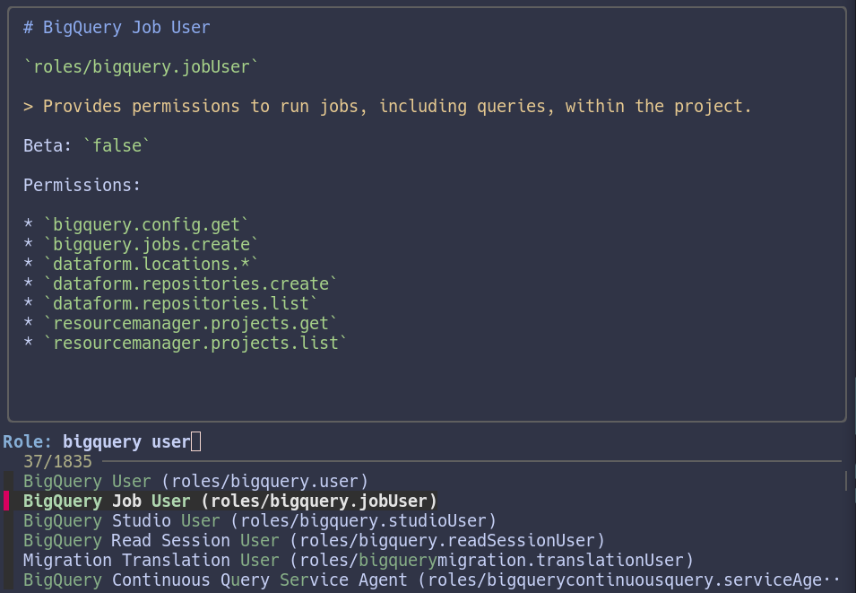

# groles

Search and browse GCP roles in your terminal. Because Google's [IAM basic and predefined
roles reference](https://cloud.google.com/iam/docs/understanding-roles) is one of the
more painful websites to use on the web.



## Installation

_For now, only Linux is supported. macOS compatibility PRs welcome!_

`groles` is just a script that uses:

* fzf <https://github.com/junegunn/fzf>
* bat <https://github.com/sharkdp/bat>
* jq <https://jqlang.org/>
* curl <https://curl.se/>

If you have these tools installed, just download `groles` from the [latest
release](https://github.com/pcrock-thmdo/flyscrape-test/releases/tag/v0.1.1) and run:

```bash
chmod +x ./groles
```

Ideally put `groles` somewhere on your `$PATH`.

## Usage

Just run `groles`.

On the first run, `groles` will automatically download the latest GCP role data to your
machine. Later, if you want to make sure you have the latest role data available, you
can run `groles --update`.
